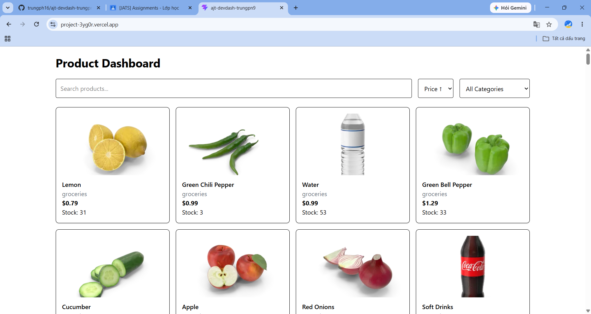
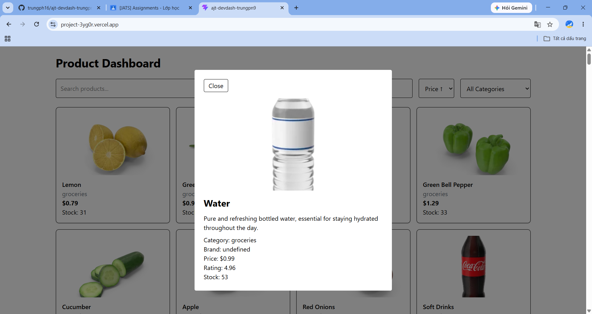

# DevDash — Typed Async Dashboard

## 📖 Mô tả dự án
DevDash là một ứng dụng Bảng điều khiển (Dashboard) trang đơn (SPA) quy mô nhỏ, được xây dựng hoàn toàn bằng **TypeScript** và **Vite** . Dự án tập trung vào việc quản lý dữ liệu bất đồng bộ (async/await, Promise.all), xử lý lỗi an toàn và áp dụng hệ thống kiểu tĩnh chặt chẽ (strict types, generics, discriminated unions) mà không phụ thuộc vào các framework giao diện (như React/Vue). 

* **Live Demo:** https://project-3yg0r.vercel.app/
* **Repository:** `ajt-devdash-trungpn9`

---

## 📸 Ảnh chụp màn hình



---

## 🚀 Hướng dẫn cài đặt & Chạy dự án (Local Run)
Dự án sử dụng Node.js và Vite làm công cụ build. Để chạy dự án trên máy cá nhân, vui lòng thực hiện các bước sau:

1. **Clone repository:**
   ```bash
   git clone https://github.com/<username>/ajt-devdash-trungpn9.git
   cd ajt-devdash-trungpn9
   ```
Cài đặt các gói phụ thuộc (Dependencies):
Khởi chạy môi trường phát triển (Development Server):
Mở trình duyệt ở địa chỉ http://localhost:5173 để xem ứng dụng.
Biên dịch dự án (Build for Production):


## ✅ Danh sách các tính năng đã hoàn thành (Tính điểm 10/10)
```
Dưới đây là danh sách các tính năng đã được triển khai, bám sát theo barem điểm của dự án:
🟢 Mức Pass (Nền tảng)
[x] Dự án biên dịch thành công với "strict": true trong tsconfig.json và không có bất kỳ lỗi type nào.
[x] Dữ liệu từ API được mô hình hóa rõ ràng bằng các TypeScript interfaces (Tuyệt đối không dùng any cho dữ liệu domain).
[x] Lấy (Fetch) và hiển thị thành công một danh sách dữ liệu bằng async/await.
[x] Tất cả các hàm và tham số đều được chú thích kiểu dữ liệu (type-annotated) chính xác.
[x] Có xử lý lỗi try/catch hoàn chỉnh, và hiển thị rõ trạng thái lỗi (error state) ra giao diện UI (không để xảy ra unhandled rejections).
[x] Tính năng xem chi tiết: Nhấp vào một mục để xem chi tiết theo id.
🟡 Mức Good (Kỹ thuật trung cấp)
[x] Tính năng Tìm kiếm / Lọc / Sắp xếp danh sách được triển khai bằng các Higher-Order Functions (map, filter, reduce).
[x] Xây dựng và tái sử dụng một hàm helper generic fetchJson<T> cho toàn bộ ứng dụng.
[x] Sử dụng Promise.all để tải 2 hoặc nhiều tài nguyên mạng song song (Ví dụ: Tải danh sách item và danh mục cùng lúc).
[x] Trạng thái của ứng dụng (State) được định nghĩa bằng union/literal type (VD: "idle" | "loading" | "success" | "error").
🌟 Mức Excellent (Kỹ thuật nâng cao)
[x] Nâng cấp State thành một Discriminated Union (có gắn thẻ tag) và sử dụng cơ chế thu hẹp kiểu triệt để (exhaustive narrowing) bằng switch/case.
[x] Sử dụng ít nhất một Utility types có ý nghĩa (VD: Pick, Omit, Partial, hoặc Record) để chuyển đổi kiểu dữ liệu.
[x] Viết thành công một Generic Class hoặc một Generic utility có chứa ràng buộc (constraints).
[x] Áp dụng kỹ thuật Closure để tạo hàm Memoization hoặc Debounce cho thanh tìm kiếm nhằm tối ưu hiệu năng.
[x] Kiến trúc code được chia module sạch sẽ (clean module architecture), dọn sạch console.log, code format đẹp và có file README đầy đủ hướng dẫn.
```
🛠 Nguồn API sử dụng
Base API: https://dummyjson.com/

